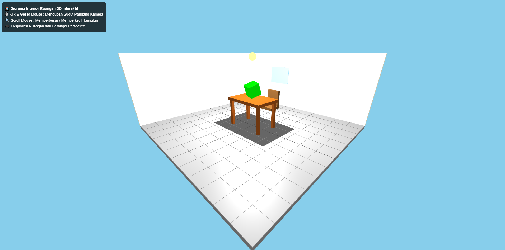

# 🏠 Diorama Interior Ruangan 3D Interaktif



## 🌐 Live Demo

- GitHub Pages : 
https://faiztzy.github.io/diorama-3d/
- Vercel : 
https://diorama-3d-theta.vercel.app/

Proyek ini merupakan simulasi **Diorama Ruangan 3D Interaktif** yang dikembangkan menggunakan **HTML5, CSS3, JavaScript, dan Three.js** sebagai implementasi konsep dasar Grafika Komputer. Aplikasi menampilkan lingkungan ruangan tiga dimensi yang dapat dieksplorasi pengguna melalui kontrol kamera interaktif.

## ✨ Fitur Utama

* 🎮 Kontrol kamera interaktif menggunakan mouse
* 🔍 Zoom in dan zoom out menggunakan scroll mouse
* 🏠 Model ruangan 3D sederhana (lantai dan dinding)
* 🪑 Objek furnitur berupa meja dan kursi
* 💡 Sistem pencahayaan 3D
* 🪟 Jendela transparan sebagai elemen dekoratif
* 🟩 Objek animasi (kubus berputar)
* 📱 Tampilan responsif pada berbagai ukuran layar

## 🛠️ Teknologi yang Digunakan

* HTML5
* CSS3
* JavaScript
* Three.js
* OrbitControls

## 📂 Struktur Proyek

```
diorama-3d/
│
├── index.html
├── css/
│   └── style.css
├── js/
│   └── script.js
└── README.md
    screenshot.png
```

## 🚀 Cara Menjalankan

### Menjalankan Secara Lokal

1. Clone repository

```bash
git clone https://github.com/faiztzy/diorama-3d.git
          
```

2. Buka folder proyek

```bash
cd diorama-3d
```

3. Jalankan menggunakan Live Server pada Visual Studio Code.

### Akses Online

Website dapat diakses melalui:

* GitHub Pages
  https://faiztzy.github.io/diorama-3d/
* Vercel
  https://diorama-3d-theta.vercel.app/

## 📚 Konsep Grafika Komputer yang Diimplementasikan

* Pemodelan Objek 3D
* Transformasi Objek
* Sistem Kamera Perspektif
* Pencahayaan (Lighting)
* Rendering Real-Time
* Animasi Objek
* Interaksi Pengguna

## 🎓 Tujuan Proyek

Proyek ini dibuat sebagai tugas/Ujian Akhir Semester (UAS) mata kuliah Grafika Komputer untuk memahami penerapan teknologi visualisasi 3D berbasis web menggunakan Three.js.

## 👨‍💻 Pengembang

**Nur Faiz Darmahidayanto**

Mahasiswa Teknik Informatika

---

⭐ Terima kasih telah mengunjungi proyek ini.
